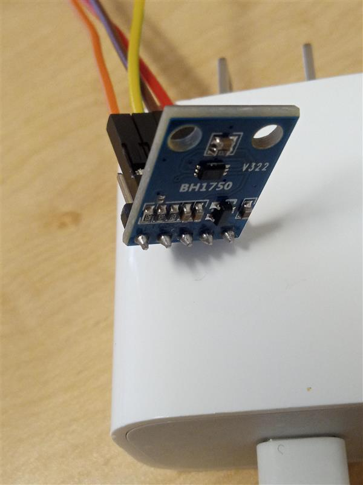
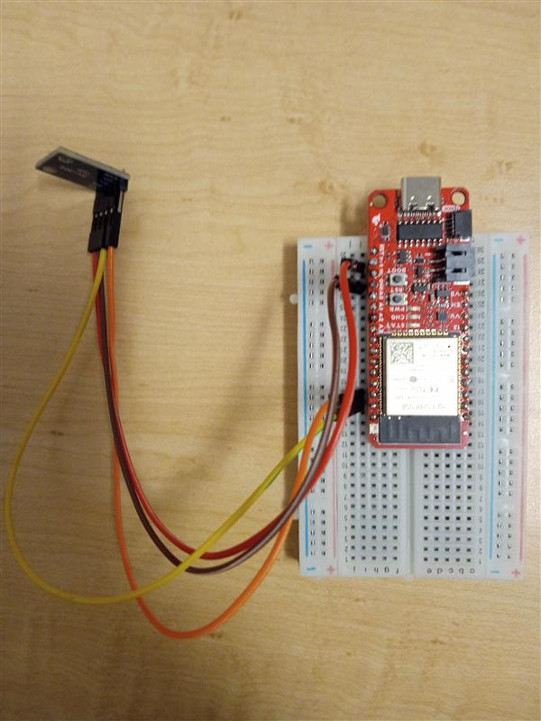
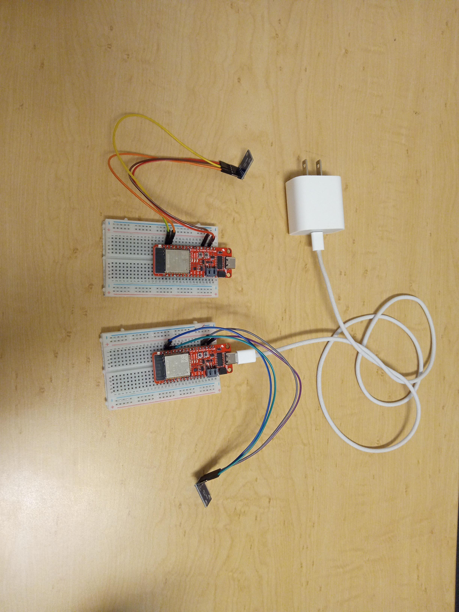

## 📡 Embedded Hardware

ESP32 (SparkFun Thing) on a half-size breadboard connected via I²C to a BH1750 ambient light sensor (V322). Measures lux at 16-bit resolution over VCC, GND, SDA, SCL.

| | | |
|:---:|:---:|:---:|
|  |  |  |
| BH1750 module with I²C header pins and color-coded jumper wires. | ESP32 on breadboard wired to BH1750, ready for USB firmware upload. | Two-sensor deployment powered from a single USB wall adapter — used for weekend long-run tests. |
